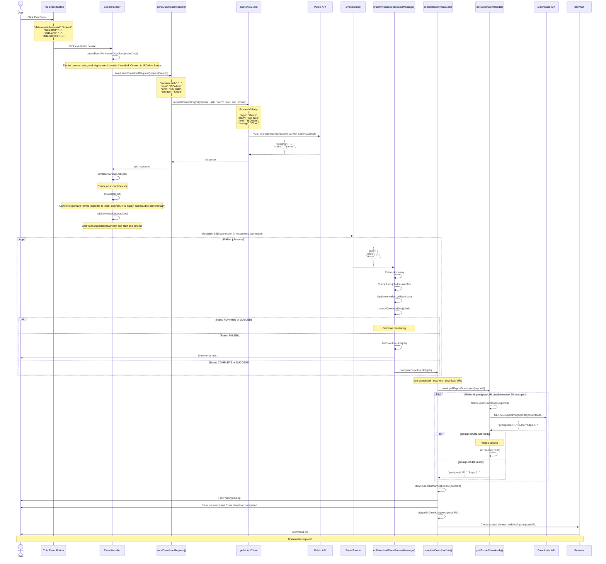

# ALE-8477: ExportsV2 "This Event" Download Flow

This diagram shows the complete flow for downloading a single event using the new exportsV2 API.

## Key Components

### 1. sendDownloadRequest()
- Takes request parameters (cameraHash, start, end, storage)
- Calls `publicApiClient.requestCameraExport()` with individual parameters
- Returns the export job response with `exportId`

### 2. publicApiClient.requestCameraExport()
- Located in: `~/camcloud/repos/tpl_shared/js/scripts.js`
- Builds the ExportsV2Body payload: `{ type: 'Batch', start, end, storage }`
- POSTs to `/v1/cameras/{id}/exportsV2`

### 3. EventSource Monitoring
- Monitors job status via SSE stream at `/settings?task=eventsource.status`
- Receives updates with job status changes
- Legacy format uses `jobId` field name (but contains exportId value)

### 4. pollExportDownloads()
- Polls `/v1/exportsV2/{exportId}/downloads` endpoint
- Checks every 1 second for up to 30 seconds
- Returns immediately when `presignedURL` is available
- Throws error if URL not available after max attempts

### 5. completeDownloadJob()
- Called when EventSource reports job as COMPLETE
- Polls for download URL using `pollExportDownloads()`
- Triggers browser download when URL is ready
- Handles errors and shows appropriate user notifications

## API Endpoints

1. **Create Export**: `POST /v1/cameras/{id}/exportsV2`
   - Request Body: `{ type: 'Batch', start, end, storage }`
   - Response: `{ exportId, status: 'Queued', ... }`

2. **Get Download URL**: `GET /v1/exportsV2/{exportId}/downloads`
   - Response: `{ presignedURL: "https://..." }`
   - May return `null` initially, requires polling

3. **Monitor Status**: `GET /settings?task=eventsource.status` (SSE)
   - Streams job status updates
   - Message format: `{ jobs: [{ jobId, status, ... }] }`

## Data Flow

1. User clicks "This Event" button
2. Export job created with exportsV2 API
3. Job added to manifest for tracking
4. EventSource monitors job status
5. When job completes, start polling for download URL
6. Once URL available, trigger browser download
7. Clean up manifest and show success message
