# ALE-8858: camc_camcloud_plan_history Table References

## Overview
This document lists all repositories in /repos that reference and update/add to the `camc_camcloud_plan_history` table in the database.

---

## Repositories with INSERT/UPDATE Operations

### 1. com_ccfusebill ✍️
- **File**: `components/com_ccfusebill/helpers/WebHookEventHandlers/BaseEventHandler.php:201`
- **Operation**: INSERT
- **Query Method**: Joomla Database API (query builder)
  - Uses `JFactory::getDbo()`, `$db->getQuery(true)`
  - Methods: `->insert()`, `->columns()`, `->values()`, `$db->execute()`
- **Purpose**: Logs plan changes from Fusebill webhook events (upgrades, downgrades, renewals)
- **Method**: `insertPlanHistoryEntry()`
- **Fields Inserted**: 
  - `user_id`
  - `service_provider_id`
  - `reseller_id`
  - `plan_id`
  - `prepay`
  - `camera_limit`
  - `dvr_limit`
  - `start_date`
  - `logging_date`
  - `event`
- **Returns**: `plan_history_id` (used to insert related addon history)

### 2. camcloud-mobile-api ✍️
- **Files**: 
  - `api/shared/UserAPIUtils.php:1984`
  - `api/shared/UserAPIUtils.php:2173`
- **Operation**: INSERT
- **Query Method**: Raw SQL with MySQLi prepared statements
  - Uses `$mysqli->prepare()`, `->bind_param()`, `->execute()`
  - Example: `INSERT INTO camc_camcloud_plan_history (...) VALUES (?,?,?,?,?,?,?,?,?,?,?,?)`
- **Purpose**: Logs "CANCEL" events when users delete their accounts
- **Event Type**: "CANCEL"
- **Fields Inserted**:
  - `plan_history_id` (null)
  - `user_id`
  - `service_provider_id`
  - `reseller_id`
  - `bt_subscription_id`
  - `pp_payment_id`
  - `plan_id`
  - `prepay`
  - `camera_limit`
  - `dvr_limit`
  - `start_date`
  - `logging_date`
  - `event` ("CANCEL")

### 3. com_ccplandetails 📋
- **File**: `tables/camcloudplanhistory.php:16`
- **Operation**: Defines JTable model (potential INSERT/UPDATE/READ via ORM)
- **Query Method**: Joomla JTable ORM
- **Purpose**: Provides table definition for accessing plan history
- **Primary Key**: `plan_history_id`

---

## Repositories with READ-only Operations

### 4. com_ccadminportal 📖
- **Files**: 
  - `site/models/ccadminportal.php:1796, 1801, 1803, 1884`
  - `site/models/ccsubusers.php:1796, 1801, 1803, 1884`
  - `site/controller.php:1279, 1285, 1295-1296, 1301, 1328`
- **Operation**: SELECT with INNER JOIN
- **Query Method**: Joomla Database API (query builder)
  - Uses `$db->getQuery(true)`
  - Methods: `->select()`, `->from()`, `->join()`, `->where()`
- **Purpose**: Exports complete plan history for reporting and CSV downloads
- **Methods**:
  - `getPlanHistory()`
  - `getPlanHistoryForExport()`
  - `getPlanHistoryForExportWithAccess()`
  - `exportPlanHistory()` - generates "plan-history.csv"
- **Join Details**: `INNER JOIN #__camcloud_plan_history h ON h.user_id = u.user_id`
- **Fields Selected**: `start_date`, `plan_history_id`, `camera_limit`, `event`

### 5. camcloud-mobile-api (also READ)
- **File**: `api/v3/index.php:80`
- **Operation**: SELECT
- **Query Method**: Raw SQL with MySQLi prepared statements
  - Example: `SELECT user_id, event FROM camc_camcloud_plan_history WHERE user_id = ?`
- **Purpose**: Checks if account has been cancelled before cleanup

---

## Operations Summary Table

| Repository | READ | INSERT | UPDATE | DELETE | Query Method |
|------------|------|--------|--------|--------|--------------|
| **com_ccfusebill** | No | **Yes** (Line 201) | No | No | Joomla Database API |
| **com_ccadminportal** | **Yes** (Multiple joins & selects) | No | No | No | Joomla Database API |
| **camcloud-mobile-api** | **Yes** (Line 80) | **Yes** (Lines 1984, 2173) | No | No | Raw SQL (MySQLi) |
| **com_ccplandetails** | Potential (via JTable) | Potential (via JTable) | Potential (via JTable) | No | Joomla JTable ORM |

---

## Key Insights

1. **No UPDATE or DELETE operations found** - The table appears to be append-only for audit purposes

2. **INSERT Operations**:
   - **com_ccfusebill**: Logs all plan changes from Fusebill webhooks (upgrades, downgrades, renewals)
   - **camcloud-mobile-api**: Logs "CANCEL" events when users delete their accounts

3. **READ Operations**:
   - **com_ccadminportal**: Exports complete plan history for reporting and analytics
   - **camcloud-mobile-api**: Validates account status before deletion

4. **Query Methods**:
   - **Joomla components** (`com_ccfusebill`, `com_ccadminportal`, `com_ccplandetails`): Use Joomla's database abstraction layer (query builder or JTable ORM)
   - **camcloud-mobile-api**: Uses raw SQL with MySQLi prepared statements for direct database access

5. **Related Tables**:
   - `#__camcloud_addon_history`: Linked via `plan_history_id` for tracking add-on changes
   - Always written together with plan history entries

6. **Table Naming Convention**:
   - Joomla components use: `#__camcloud_plan_history` (with Joomla prefix token)
   - Mobile API uses: `camc_camcloud_plan_history` (direct table name with `camc_` prefix)

---

## Complete File Paths Reference

### INSERT Operations
1. `com_ccfusebill/components/com_ccfusebill/helpers/WebHookEventHandlers/BaseEventHandler.php:201`
2. `camcloud-mobile-api/api/shared/UserAPIUtils.php:1984`
3. `camcloud-mobile-api/api/shared/UserAPIUtils.php:2173`

### READ Operations
1. `com_ccadminportal/site/models/ccadminportal.php:1884` (JOIN)
2. `com_ccadminportal/site/models/ccsubusers.php:1884` (JOIN)
3. `camcloud-mobile-api/api/v3/index.php:80` (SELECT)

### Table Definition
1. `com_ccplandetails/tables/camcloudplanhistory.php:16`

### Documentation References
1. `com_ccfusebill/AGENTS.md:95`
2. `camcloud-mobile-api/DATABASE-QUERIES.md:115`

---

## Summary

- **2 repos** actively INSERT records: `com_ccfusebill` and `camcloud-mobile-api`
- **1 repo** provides table model: `com_ccplandetails`
- **2 repos** read data: `com_ccadminportal` and `camcloud-mobile-api`
- **No UPDATE or DELETE operations found** (append-only audit table)
- **Total repos with references**: 4 repositories

---

## Implementation Guide: Making Plan History Table Standalone

### Objective
Make the `camc_camcloud_plan_history` table self-contained by storing snapshots of user/reseller data at the time of each plan change. This ensures historical data remains accurate even if users or resellers are deleted.

---

### Visual Overview: Current vs. New Flow

#### Current Flow (Before Implementation)


#### New Flow (After Implementation)

```mermaid
sequenceDiagram
    participant WH as Fusebill Webhook
    participant API as Mobile API
    participant FB as com_ccfusebill
    participant MA as camcloud-mobile-api
    participant UT as User Tables (for snapshot lookup)
    participant DB as camc_camcloud_plan_history
    participant AP as com_ccadminportal

    Note over WH,AP: WRITE Operations (Plan Changes)
    
    WH->>FB: Plan change event (upgrade/downgrade)
    FB->>UT: Query current user/reseller data
    UT-->>FB: Return username, email, reseller_name, domain, admin_count
    FB->>DB: INSERT plan_history + snapshots
    Note over DB: Stores IDs + snapshot data<br/>(username_snapshot, email_snapshot, etc.)
    
    API->>MA: User deletes account
    MA->>UT: Query current user/reseller data
    UT-->>MA: Return snapshot data
    MA->>DB: INSERT plan_history (CANCEL) + snapshots
    Note over DB: Complete snapshot preserved
    
    Note over WH,AP: READ Operations (Exports)
    
    AP->>DB: Query plan history with COALESCE
    Note over DB: COALESCE(snapshot, live_data)
    DB->>UT: LEFT JOIN (optional, for non-deleted users)
    DB-->>AP: Returns snapshot data (works even if user deleted)
    AP->>AP: Generate CSV export
    
    Note over AP: ✅ Solution: Complete data always available
```


#### Data Flow: Snapshot Creation


---

### Step 1: Update Database Schema and Backfill Existing Data

**Goal**: Add snapshot columns and populate them for existing records in a single operation.

**Action**: Run the following combined SQL script:

```sql
-- Add snapshot columns to the table
ALTER TABLE camc_camcloud_plan_history
    ADD COLUMN username_snapshot              VARCHAR(150) NULL,
    ADD COLUMN email_snapshot                 VARCHAR(100) NULL,
    ADD COLUMN reseller_id_snapshot           INT UNSIGNED NULL,
    ADD COLUMN reseller_name_snapshot         VARCHAR(60)  NULL,
    ADD COLUMN domain_snapshot                VARCHAR(40)  NULL,
    ADD COLUMN admin_count_snapshot           INT          NULL;

-- Backfill existing records with snapshot data
UPDATE camc_camcloud_plan_history h
JOIN camc_camcloud_users u ON u.user_id = h.user_id
JOIN camc_users su ON su.id = u.j_id
LEFT JOIN camc_camcloud_resellers re
       ON re.reseller_id = COALESCE(u.reseller_id, h.reseller_id)
LEFT JOIN camc_camcloud_service_providers s
       ON s.service_provider_id = COALESCE(u.service_provider_id, h.service_provider_id)
LEFT JOIN (
    SELECT 
        u.user_id,
        (COUNT(DISTINCT CASE WHEN msp.master_admingroup_id IS NOT NULL THEN msp.master_admingroup_id END) +
         COUNT(DISTINCT CASE WHEN sp_admin.service_provider_admingroup_id IS NOT NULL THEN sp_admin.service_provider_admingroup_id END) +
         COUNT(DISTINCT CASE WHEN re_admin.reseller_admingroup_id IS NOT NULL THEN re_admin.reseller_admingroup_id END)) AS admin_count
    FROM camc_camcloud_users u
    LEFT JOIN camc_user_usergroup_map ugm ON ugm.user_id = u.j_id
    LEFT JOIN camc_camcloud_master_service_providers msp ON ugm.group_id = msp.master_admingroup_id
    LEFT JOIN camc_camcloud_service_providers sp_admin ON ugm.group_id = sp_admin.service_provider_admingroup_id
    LEFT JOIN camc_camcloud_resellers re_admin ON ugm.group_id = re_admin.reseller_admingroup_id
    GROUP BY u.user_id
) admin_counts ON admin_counts.user_id = u.user_id
SET
    h.username_snapshot      = su.username,
    h.email_snapshot         = su.email,
    h.reseller_id_snapshot   = COALESCE(u.reseller_id, h.reseller_id),
    h.reseller_name_snapshot = re.name,
    h.domain_snapshot        = s.domain,
    h.admin_count_snapshot   = COALESCE(admin_counts.admin_count, 0)
WHERE
    h.username_snapshot IS NULL;
```

**Notes**:
- All columns are NULL-able for backwards compatibility
- The UPDATE only affects records where `username_snapshot IS NULL` (existing data)
- Safe to run multiple times (idempotent)
- This backfills data only for users that still exist in the system
- Records for deleted users will remain with NULL snapshots (will be populated by new INSERT code going forward)
- Run during low-traffic period if table is large
- Consider testing on a staging database first

**Performance Considerations**:
- For very large tables, consider running the UPDATE in batches:
  ```sql
  -- Run this multiple times until 0 rows affected
  UPDATE camc_camcloud_plan_history h
  ... (same query as above)
  WHERE h.username_snapshot IS NULL
  LIMIT 10000;
  ```

---

### Step 2: Update Code that Inserts Plan History Entries

**Goal**: Modify all INSERT operations to populate the new snapshot columns.

#### 2.1 Update com_ccfusebill

**File**: `com_ccfusebill/components/com_ccfusebill/helpers/WebHookEventHandlers/BaseEventHandler.php:201`

**Current Method**: `insertPlanHistoryEntry()` using Joomla Database API

**Required Changes**:

1. **Fetch snapshot data** before inserting:
   ```php
   // Get user and reseller snapshot data
   $db = JFactory::getDbo();
   $query = $db->getQuery(true)
       ->select([
           'su.username',
           'su.email',
           'u.reseller_id',
           'r.name AS reseller_name',
           's.domain',
           // Admin count logic - count admin group memberships
           'COUNT(DISTINCT CASE WHEN msp.master_admingroup_id IS NOT NULL THEN msp.master_admingroup_id END) + ' .
           'COUNT(DISTINCT CASE WHEN sp.service_provider_admingroup_id IS NOT NULL THEN sp.service_provider_admingroup_id END) + ' .
           'COUNT(DISTINCT CASE WHEN re.reseller_admingroup_id IS NOT NULL THEN re.reseller_admingroup_id END) AS admin_count'
       ])
       ->from($db->quoteName('#__camcloud_users', 'u'))
       ->leftJoin($db->quoteName('#__users', 'su') . ' ON su.id = u.j_id')
       ->leftJoin($db->quoteName('#__camcloud_resellers', 'r') . ' ON r.reseller_id = u.reseller_id')
       ->leftJoin($db->quoteName('#__camcloud_service_providers', 's') . ' ON s.service_provider_id = u.service_provider_id')
       ->leftJoin($db->quoteName('#__user_usergroup_map', 'ugm') . ' ON ugm.user_id = u.j_id')
       ->leftJoin($db->quoteName('#__camcloud_master_service_providers', 'msp') . ' ON ugm.group_id = msp.master_admingroup_id')
       ->leftJoin($db->quoteName('#__camcloud_service_providers', 'sp') . ' ON ugm.group_id = sp.service_provider_admingroup_id')
       ->leftJoin($db->quoteName('#__camcloud_resellers', 're') . ' ON ugm.group_id = re.reseller_admingroup_id')
       ->where($db->quoteName('u.user_id') . ' = ' . (int) $userId)
       ->group('u.user_id');
   
   $db->setQuery($query);
   $snapshot = $db->loadObject();
   ```

2. **Update the INSERT columns list**:
   ```php
   $query = $db->getQuery(true)
       ->insert($db->quoteName('#__camcloud_plan_history'))
       ->columns([
           // Existing columns
           $db->quoteName('user_id'),
           $db->quoteName('service_provider_id'),
           $db->quoteName('reseller_id'),
           $db->quoteName('plan_id'),
           $db->quoteName('prepay'),
           $db->quoteName('camera_limit'),
           $db->quoteName('dvr_limit'),
           $db->quoteName('start_date'),
           $db->quoteName('logging_date'),
           $db->quoteName('event'),
           // New snapshot columns
           $db->quoteName('username_snapshot'),
           $db->quoteName('email_snapshot'),
           $db->quoteName('reseller_id_snapshot'),
           $db->quoteName('reseller_name_snapshot'),
           $db->quoteName('domain_snapshot'),
           $db->quoteName('admin_count_snapshot')
       ]);
   ```

3. **Update the VALUES**:
   ```php
   ->values(
       (int) $userId . ', ' .
       (int) $serviceProviderId . ', ' .
       (int) $resellerId . ', ' .
       (int) $planId . ', ' .
       (int) $prepay . ', ' .
       (int) $cameraLimit . ', ' .
       (int) $dvrLimit . ', ' .
       $db->quote($startDate) . ', ' .
       $db->quote($loggingDate) . ', ' .
       $db->quote($event) . ', ' .
       // New snapshot values
       $db->quote($snapshot->username) . ', ' .
       $db->quote($snapshot->email) . ', ' .
       (int) $snapshot->reseller_id . ', ' .
       $db->quote($snapshot->reseller_name) . ', ' .
       $db->quote($snapshot->domain) . ', ' .
       (int) $snapshot->admin_count
   );
   ```

#### 2.2 Update camcloud-mobile-api (UserAPIUtils.php)

**Files**: 
- `camcloud-mobile-api/api/shared/UserAPIUtils.php:1984`
- `camcloud-mobile-api/api/shared/UserAPIUtils.php:2173`

**Current Method**: Raw SQL with MySQLi prepared statements

**Required Changes**:

1. **Fetch snapshot data** before the INSERT:
   ```php
   // Get snapshot data for the user
   $snapshotQuery = "
       SELECT 
           su.username,
           su.email,
           u.reseller_id,
           r.name AS reseller_name,
           s.domain,
           (
               COUNT(DISTINCT CASE WHEN msp.master_admingroup_id IS NOT NULL THEN msp.master_admingroup_id END) +
               COUNT(DISTINCT CASE WHEN sp_admin.service_provider_admingroup_id IS NOT NULL THEN sp_admin.service_provider_admingroup_id END) +
               COUNT(DISTINCT CASE WHEN re_admin.reseller_admingroup_id IS NOT NULL THEN re_admin.reseller_admingroup_id END)
           ) AS admin_count
       FROM camc_camcloud_users u
       LEFT JOIN camc_users su ON su.id = u.j_id
       LEFT JOIN camc_camcloud_resellers r ON r.reseller_id = u.reseller_id
       LEFT JOIN camc_camcloud_service_providers s ON s.service_provider_id = u.service_provider_id
       LEFT JOIN camc_user_usergroup_map ugm ON ugm.user_id = u.j_id
       LEFT JOIN camc_camcloud_master_service_providers msp ON ugm.group_id = msp.master_admingroup_id
       LEFT JOIN camc_camcloud_service_providers sp_admin ON ugm.group_id = sp_admin.service_provider_admingroup_id
       LEFT JOIN camc_camcloud_resellers re_admin ON ugm.group_id = re_admin.reseller_admingroup_id
       WHERE u.user_id = ?
       GROUP BY u.user_id
   ";
   
   $snapshotStmt = $mysqli->prepare($snapshotQuery);
   $snapshotStmt->bind_param('i', $userId);
   $snapshotStmt->execute();
   $snapshotResult = $snapshotStmt->get_result();
   $snapshot = $snapshotResult->fetch_assoc();
   $snapshotStmt->close();
   ```

2. **Update the INSERT statement**:
   ```php
   $insertQuery = "
       INSERT INTO camc_camcloud_plan_history (
           plan_history_id,
           user_id,
           service_provider_id,
           reseller_id,
           bt_subscription_id,
           pp_payment_id,
           plan_id,
           prepay,
           camera_limit,
           dvr_limit,
           start_date,
           logging_date,
           event,
           username_snapshot,
           email_snapshot,
           reseller_id_snapshot,
           reseller_name_snapshot,
           domain_snapshot,
           admin_count_snapshot
       ) VALUES (?, ?, ?, ?, ?, ?, ?, ?, ?, ?, ?, ?, ?, ?, ?, ?, ?, ?, ?)
   ";
   ```

3. **Update bind_param call**:
   ```php
   $stmt = $mysqli->prepare($insertQuery);
   $stmt->bind_param(
       'iiiiissiiiisssssssi',  // Updated type string (added 6 more 's' and 1 'i')
       $planHistoryId,          // NULL for CANCEL
       $userId,
       $serviceProviderId,
       $resellerId,
       $btSubscriptionId,
       $ppPaymentId,
       $planId,
       $prepay,
       $cameraLimit,
       $dvrLimit,
       $startDate,
       $loggingDate,
       $event,
       // New snapshot values
       $snapshot['username'],
       $snapshot['email'],
       $snapshot['reseller_id'],
       $snapshot['reseller_name'],
       $snapshot['domain'],
       $snapshot['admin_count']
   );
   $stmt->execute();
   $stmt->close();
   ```

**Testing**: After deploying these changes, all new plan history entries will be self-contained.

---

### Step 3: Update Export Queries

**Goal**: Modify READ operations to use snapshot columns with fallback to live data.

#### 3.1 Update com_ccadminportal Export Queries

**Files**: 
- `com_ccadminportal/site/models/ccadminportal.php`
- `com_ccadminportal/site/models/ccsubusers.php`

**Methods to Update**:
- `getPlanHistory()`
- `getPlanHistoryForExport()`
- `getPlanHistoryForExportWithAccess()`

**Current Query Pattern**:
```php
$query->select([
    'su.username',
    'su.email',
    're.name AS reseller_name',
    's.domain',
    // ... other fields
])
->from($db->quoteName('#__camcloud_plan_history', 'h'))
->innerJoin($db->quoteName('#__camcloud_users', 'u') . ' ON u.user_id = h.user_id')
->leftJoin($db->quoteName('#__users', 'su') . ' ON su.id = u.j_id')
->leftJoin($db->quoteName('#__camcloud_resellers', 're') . ' ON re.reseller_id = u.reseller_id')
->leftJoin($db->quoteName('#__camcloud_service_providers', 's') . ' ON s.service_provider_id = u.service_provider_id');
```

**Updated Query Pattern**:
```php
$query->select([
    // Use snapshot with fallback to live data
    'COALESCE(h.username_snapshot, su.username) AS username',
    'COALESCE(h.email_snapshot, su.email) AS email',
    'COALESCE(h.reseller_name_snapshot, re.name) AS reseller_name',
    'COALESCE(h.domain_snapshot, s.domain) AS domain',
    'COALESCE(h.admin_count_snapshot, u.reseller_admin) AS admin_count',
    'COALESCE(h.reseller_id_snapshot, re.reseller_id) AS reseller_id',
    
    // Plan details from history
    'h.user_id',
    'h.plan_history_id',
    'h.camera_limit',
    'h.start_date',
    'h.event',
    
    // Plan name mapping
    'CASE ' .
        'WHEN p.jtext_plan_key = \'LANG_CCPLANS_PLAN_CC_4HOUR\' THEN \'4 hours retention\' ' .
        'WHEN p.jtext_plan_key = \'LANG_CCPLANS_PLAN_RET_7\' THEN \'7 Day\' ' .
        'WHEN p.jtext_plan_key = \'LANG_CCPLANS_PLAN_RET_14\' THEN \'14 Day\' ' .
        'WHEN p.jtext_plan_key = \'LANG_CCPLANS_PLAN_RET_30\' THEN \'30 Day\' ' .
        'WHEN p.jtext_plan_key = \'LANG_CCPLANS_PLAN_RET_60\' THEN \'60 Day\' ' .
        'WHEN p.jtext_plan_key = \'LANG_CCPLANS_PLAN_RET_90\' THEN \'90 Day\' ' .
        // ... add all other CASE conditions from the Jira description
        'ELSE \'Free\' ' .
    'END AS Plan',
    
    // Addon data
    'a.addon_history_id',
    'a.addon_code',
    'a.quantity',
    
    // Custom fields
    'r.value AS reseller_acct'
])
->from($db->quoteName('#__camcloud_plan_history', 'h'))
// CHANGE: Use LEFT JOIN instead of INNER JOIN to handle deleted users
->leftJoin($db->quoteName('#__camcloud_addon_history', 'a') . ' ON a.plan_history_id = h.plan_history_id')
->leftJoin($db->quoteName('#__camcloud_users', 'u') . ' ON u.user_id = h.user_id')
->leftJoin($db->quoteName('#__users', 'su') . ' ON su.id = u.j_id')
->leftJoin($db->quoteName('#__camcloud_plans', 'p') . ' ON p.plan_id = h.plan_id')
// CHANGE: Join resellers using snapshot ID when available
->leftJoin(
    $db->quoteName('#__camcloud_resellers', 're') . 
    ' ON re.reseller_id = COALESCE(h.reseller_id_snapshot, u.reseller_id, h.reseller_id)'
)
->leftJoin(
    $db->quoteName('#__camcloud_service_providers', 's') . 
    ' ON s.service_provider_id = COALESCE(h.service_provider_id, u.service_provider_id)'
)
->leftJoin(
    $db->quoteName('#__camcloud_custom_fields_resellers_map', 'r') . 
    ' ON r.reseller_id = COALESCE(h.reseller_id_snapshot, re.reseller_id)'
)
->where($db->quoteName('h.service_provider_id') . ' IN (' . implode(',', $serviceProviderIds) . ')')
->order('username ASC, h.start_date ASC');
```

**Key Changes**:
1. Changed `INNER JOIN` to `LEFT JOIN` for users table (handles deleted users)
2. Use `COALESCE()` to prefer snapshot data, fall back to live data
3. Join resellers/SPs using snapshot IDs when available
4. Add admin_count from snapshot

#### 3.2 Update Employee Plan History Export

**Same files as above, different method**

**Updated Query Pattern for Employee Export**:
```php
$query->select([
    'h.user_id',
    
    // Identity - prefer snapshot
    'COALESCE(h.username_snapshot, su.username) AS username',
    'COALESCE(h.email_snapshot, su.email) AS email',
    
    // Plan details
    'p.jtext_plan_key',
    'h.start_date',
    'h.plan_history_id',
    'h.camera_limit',
    'h.event',
    
    // Reseller - prefer snapshot
    'COALESCE(h.reseller_id_snapshot, u.reseller_id, h.reseller_id) AS reseller_id',
    'COALESCE(h.reseller_name_snapshot, re.name) AS reseller_name',
    
    // SP domain - prefer snapshot
    'COALESCE(h.domain_snapshot, s.domain) AS domain',
    
    // Postal codes
    'pf.profile_value AS end_user_postal_code',
    're.postal_code AS reseller_postal_code',
    
    // Rep firm
    'IF(rf.name IS NULL, \'None\', rf.name) AS rep_firm_name',
    're.rep_firm_id',
    
    // Admin count - prefer snapshot, compute live as fallback
    'COALESCE(' .
        'h.admin_count_snapshot, ' .
        'SUM(IF(msp_admin.master_admingroup_id IS NULL, 0, 1)) + ' .
        'SUM(IF(sp_admin.service_provider_admingroup_id IS NULL, 0, 1)) + ' .
        'SUM(IF(re_admin.reseller_admingroup_id IS NULL, 0, 1))' .
    ') AS admin_count'
])
->from($db->quoteName('#__camcloud_plan_history', 'h'))
// User may not exist
->leftJoin($db->quoteName('#__camcloud_users', 'u') . ' ON u.user_id = h.user_id')
->leftJoin($db->quoteName('#__users', 'su') . ' ON su.id = u.j_id')
// Plan via history
->leftJoin($db->quoteName('#__camcloud_plans', 'p') . ' ON p.plan_id = h.plan_id')
// SP - prefer history SP ID
->leftJoin(
    $db->quoteName('#__camcloud_service_providers', 's') . 
    ' ON s.service_provider_id = COALESCE(h.service_provider_id, u.service_provider_id)'
)
// Reseller - prefer snapshot, then user, then history
->leftJoin(
    $db->quoteName('#__camcloud_resellers', 're') . 
    ' ON re.reseller_id = COALESCE(h.reseller_id_snapshot, u.reseller_id, h.reseller_id)'
)
// End-user postal (only works while user exists)
->leftJoin(
    $db->quoteName('#__user_profiles', 'pf') . 
    ' ON pf.user_id = su.id AND (pf.profile_key IS NULL OR pf.profile_key = \'profile.postal_code\')'
)
// Rep firm
->leftJoin(
    $db->quoteName('#__camcloud_rep_firms', 'rf') . 
    ' ON rf.service_provider_id = s.service_provider_id AND re.rep_firm_id = rf.rep_firm_id'
)
// Admin groups (only exist while user exists)
->leftJoin($db->quoteName('#__user_usergroup_map', 'group_map') . ' ON group_map.user_id = u.j_id')
->leftJoin($db->quoteName('#__camcloud_master_service_providers', 'msp_admin') . ' ON group_map.group_id = msp_admin.master_admingroup_id')
->leftJoin($db->quoteName('#__camcloud_service_providers', 'sp_admin') . ' ON group_map.group_id = sp_admin.service_provider_admingroup_id')
->leftJoin($db->quoteName('#__camcloud_resellers', 're_admin') . ' ON group_map.group_id = re_admin.reseller_admingroup_id')
->group('h.plan_history_id')
->order('username ASC, h.start_date ASC');
```

**Key Changes**:
1. All user/reseller fields use `COALESCE()` to prefer snapshot data
2. Admin count prefers snapshot, computes live as fallback
3. Reseller joins use snapshot ID precedence
4. Works correctly even if user has been deleted

---

### Testing Checklist

After implementing all steps:

- [ ] **Step 1**: Verify schema changes and backfill completed successfully
  ```sql
  -- Check schema
  DESCRIBE camc_camcloud_plan_history;
  
  -- Verify backfill results (should show counts of filled vs NULL snapshots)
  SELECT 
      COUNT(*) as total_records,
      SUM(CASE WHEN username_snapshot IS NOT NULL THEN 1 ELSE 0 END) as records_with_snapshots,
      SUM(CASE WHEN username_snapshot IS NULL THEN 1 ELSE 0 END) as records_without_snapshots
  FROM camc_camcloud_plan_history;
  ```

- [ ] **Step 2**: Test INSERT operations
  - [ ] Trigger Fusebill webhook (upgrade/downgrade plan)
  - [ ] Delete test account via mobile API
  - [ ] Verify new rows have populated snapshot columns:
    ```sql
    SELECT * FROM camc_camcloud_plan_history 
    WHERE username_snapshot IS NOT NULL 
    ORDER BY plan_history_id DESC LIMIT 5;
    ```

- [ ] **Step 3**: Test export queries
  - [ ] Run plan history export in admin portal
  - [ ] Verify CSV contains expected data
  - [ ] Test with deleted user scenario (create user, add plan, delete user, export)
  - [ ] Run EXPLAIN on new queries to check performance:
    ```sql
    EXPLAIN SELECT ... [new export query];
    ```

---

### Rollback Plan

If issues occur:

1. **After Step 1**: 
   - Database schema changes cannot be easily rolled back
   - However, columns are nullable so no impact on existing functionality
   - Backfilled data is additive only and doesn't break anything

2. **After Step 2**: 
   - Revert code changes to INSERT operations
   - New rows will have NULL snapshots but will work via Step 3's COALESCE fallback

3. **After Step 3**:
   - Revert export query changes
   - Old queries will work but won't use snapshot data

---

### Performance Considerations

1. **Indexes**: Consider adding indexes if export queries are slow:
   ```sql
   ALTER TABLE camc_camcloud_plan_history 
   ADD INDEX idx_username_snapshot (username_snapshot);
   
   ALTER TABLE camc_camcloud_plan_history 
   ADD INDEX idx_reseller_id_snapshot (reseller_id_snapshot);
   ```

2. **Query Optimization**: Run EXPLAIN before deploying:
   ```sql
   EXPLAIN SELECT ...
   ```

3. **Backfill Performance**: Step 1 UPDATE may take time on large tables
   - Consider batching: `WHERE h.username_snapshot IS NULL LIMIT 10000`
   - Run during low-traffic period

---

### Benefits After Implementation

1. **Data Integrity**: Historical plan data preserved even after user/reseller deletion
2. **Query Performance**: Potentially faster exports (fewer JOINs to missing data)
3. **Audit Trail**: Complete snapshot of account state at each plan change
4. **Backwards Compatible**: Incremental rollout without breaking existing functionality
