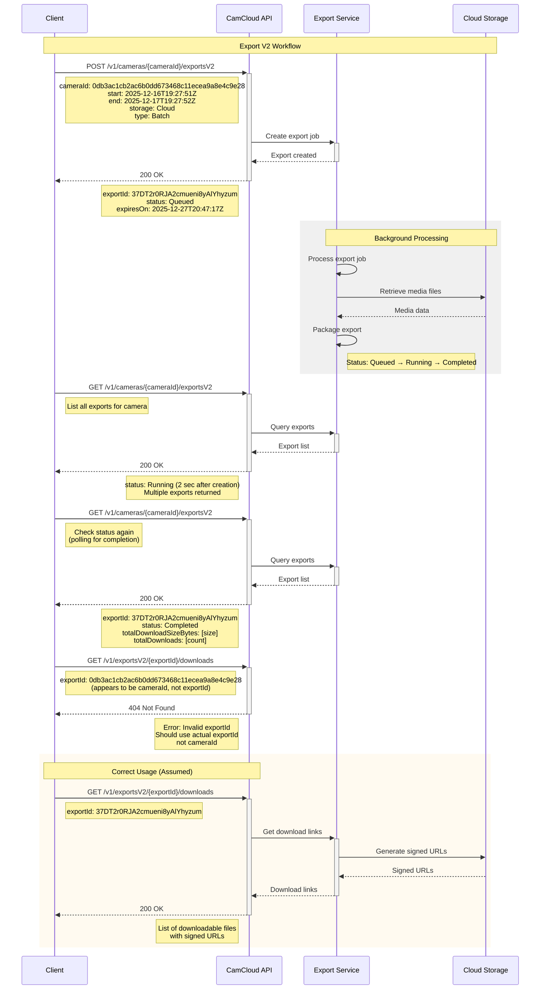

```mermaid
sequenceDiagram
    participant Client
    participant API as CamCloud API
    participant ExportService as Export Service
    participant Storage as Cloud Storage

    Note over Client,Storage: Export V2 Workflow

    %% Step 1: Create Export
    Client->>+API: POST /v1/cameras/{cameraId}/exportsV2
    Note right of Client: cameraId: 0db3ac1cb2ac6b0dd673468c11ecea9a8e4c9e28<br/>start: 2025-12-16T19:27:51Z<br/>end: 2025-12-17T19:27:52Z<br/>storage: Cloud<br/>type: Batch
    API->>+ExportService: Create export job
    ExportService-->>-API: Export created
    API-->>-Client: 200 OK
    Note left of API: exportId: 37DT2r0RJA2cmueni8yAlYhyzum<br/>status: Queued<br/>expiresOn: 2025-12-27T20:47:17Z

    %% Step 2: Background Processing
    rect rgb(240, 240, 240)
        Note over ExportService,Storage: Background Processing
        ExportService->>ExportService: Process export job
        ExportService->>Storage: Retrieve media files
        Storage-->>ExportService: Media data
        ExportService->>ExportService: Package export
        Note right of ExportService: Status: Queued → Running → Completed
    end

    %% Step 3: Poll for Status
    Client->>+API: GET /v1/cameras/{cameraId}/exportsV2
    Note right of Client: List all exports for camera
    API->>+ExportService: Query exports
    ExportService-->>-API: Export list
    API-->>-Client: 200 OK
    Note left of API: status: Running (2 sec after creation)<br/>Multiple exports returned

    %% Step 4: Poll Again (Status Changed)
    Client->>+API: GET /v1/cameras/{cameraId}/exportsV2
    Note right of Client: Check status again<br/>(polling for completion)
    API->>+ExportService: Query exports
    ExportService-->>-API: Export list
    API-->>-Client: 200 OK
    Note left of API: exportId: 37DT2r0RJA2cmueni8yAlYhyzum<br/>status: Completed<br/>totalDownloadSizeBytes: [size]<br/>totalDownloads: [count]

    %% Step 5: Get Downloads (404 - Wrong endpoint?)
    Client->>+API: GET /v1/exportsV2/{exportId}/downloads
    Note right of Client: exportId: 0db3ac1cb2ac6b0dd673468c11ecea9a8e4c9e28<br/>(appears to be cameraId, not exportId)
    API-->>-Client: 404 Not Found
    Note left of API: Error: Invalid exportId<br/>Should use actual exportId<br/>not cameraId

    %% Step 6: Correct Downloads Call (Assumed)
    rect rgb(255, 250, 240)
        Note over Client,API: Correct Usage (Assumed)
        Client->>+API: GET /v1/exportsV2/{exportId}/downloads
        Note right of Client: exportId: 37DT2r0RJA2cmueni8yAlYhyzum
        API->>+ExportService: Get download links
        ExportService->>Storage: Generate signed URLs
        Storage-->>ExportService: Signed URLs
        ExportService-->>-API: Download links
        API-->>-Client: 200 OK
        Note left of API: List of downloadable files<br/>with signed URLs
    end
```
